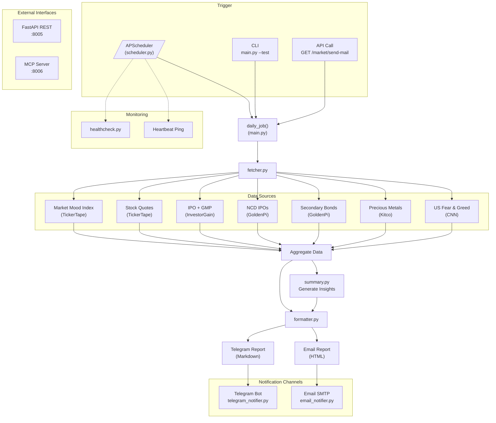
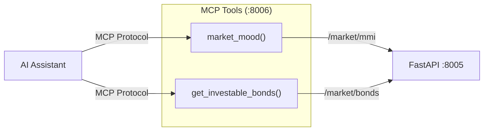
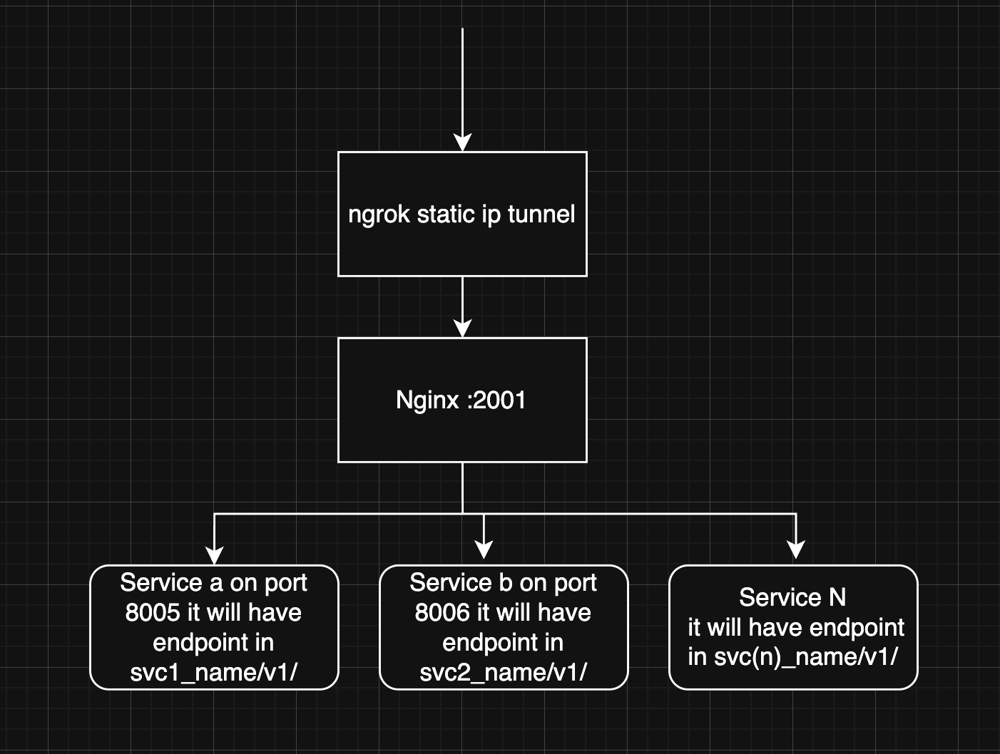

# Market Notifier

A Python application that aggregates real-time Indian market data from multiple sources and delivers daily notifications via Telegram and Email. Built with FastAPI, it also exposes REST endpoints and an MCP server for AI assistant integration.

## Features

- **Market Mood Index** — Fear & Greed gauge from TickerTape (Nifty, VIX, FII flows)
- **Stock Watchlist** — Real-time quotes with OHLC, volume, and 52-week range
- **IPO Tracker** — Equity IPOs with GMP data, ratings, and subscription status
- **NCD IPOs** — Filtered by credit rating (A- and above) and yield (10%+)
- **Secondary Bonds** — Top bond market opportunities from GoldenPi
- **Precious Metals** — Gold, Silver, Platinum, Palladium with Gold/Silver ratio
- **US Fear & Greed** — CNN sentiment breakdown (momentum, put/call, VIX, etc.)
- **AI Insights** — Auto-generated market summary combining all data points
- **Multi-channel delivery** — Telegram (Markdown) and Email (HTML)
- **Scheduled execution** — Cron-based daily job via APScheduler
- **Health monitoring** — System health checks and heartbeat pings
- **MCP Server** — Expose market tools to AI assistants via Model Context Protocol

## Architecture





## Project Structure

```
Market-Notifier/
├── main.py                  # FastAPI app, daily job orchestrator, CLI entry point
├── scheduler.py             # APScheduler cron runner + health endpoint
├── healthcheck.py           # System health checks & heartbeat
├── mcp_server.py            # MCP server (market_mood, get_investable_bonds)
├── mcp_client.py            # MCP client for testing
├── config/
│   └── settings.py          # Environment config loader
├── data/
│   ├── fetcher.py           # Master data orchestrator
│   ├── formatter.py         # Telegram & Email report formatting
│   ├── summary.py           # Market insights generator
│   └── sources/
│       ├── mmi.py           # Market Mood Index (TickerTape)
│       ├── quotes.py        # Stock quotes (TickerTape)
│       ├── ipo.py           # IPOs with GMP (InvestorGain)
│       ├── ncd.py           # NCD IPOs (GoldenPi)
│       ├── secondary_bonds.py  # Secondary bond listings (GoldenPi)
│       ├── precious_metals.py  # Gold, Silver, Platinum, Palladium
│       └── us_fear_greed.py    # US market sentiment (CNN)
├── notifications/
│   ├── telegram_notifier.py # Telegram bot sender
│   └── email_notifier.py   # SMTP email sender
├── nginx/
│   ├── nginx.conf           # Reverse proxy config (port 2001)
│   └── docker-compose.yml   # Nginx container setup
├── utils/
│   ├── crontab              # Example cron schedule
│   └── start_service.sh     # tmux-based service launcher
├── docs/
│   └── nginx_architecture.png  # Nginx routing diagram
├── requirements.txt
└── .env.example
```

## Setup

### Prerequisites

- Python 3.10+
- A Telegram bot token ([create one via BotFather](https://t.me/BotFather))
- Gmail App Password (or another SMTP provider)

### Installation

```bash
git clone <repo-url>
cd RPi_market
python -m venv venv
source venv/bin/activate
pip install -r requirements.txt
```

### Configuration

```bash
cp .env.example .env
```

Edit `.env` with your credentials:

| Variable | Description |
|---|---|
| `TELEGRAM_BOT_TOKEN` | Telegram bot token |
| `TELEGRAM_CHAT_ID` | Target chat/group ID |
| `EMAIL_SENDER` | Gmail address |
| `EMAIL_PASSWORD` | Gmail App Password |
| `EMAIL_RECEIVER` | Recipient(s), comma-separated |
| `TICKERS` | Watchlist in `SID:Name` format (e.g. `RELI:Reliance,TCS:TCS`) |
| `NOTIFY_HOUR` / `NOTIFY_MINUTE` | Daily notification time (default: 18:00) |
| `TIMEZONE` | Timezone (default: `Asia/Kolkata`) |
| `CHANNEL_TELEGRAM` / `CHANNEL_EMAIL` | Enable/disable channels (`true`/`false`) |

## Usage

### Run once (test)

```bash
python main.py --test     # Dry run — fetch data, skip notifications
python main.py            # Fetch data and send notifications
```

### Health check

```bash
python main.py --health   # Check API connectivity, bot config, SMTP
```

### Scheduled mode

```bash
python scheduler.py                       # Daily job at configured time
python scheduler.py --with-health         # + HTTP health endpoint on :8080
python scheduler.py --with-health --port 9090  # Custom port
```

### API server

```bash
# Development
uvicorn main:app --host 0.0.0.0 --port 8005

# Production (multi-worker)
gunicorn main:app --workers 3 --worker-class uvicorn.workers.UvicornWorker --bind 0.0.0.0:8005
```

The FastAPI server starts on port **8005** with the following endpoints:

| Method | Endpoint | Description |
|---|---|---|
| `GET` | `/market` | Health check |
| `GET` | `/market/mmi` | Market Mood Index data |
| `GET` | `/market/bonds` | Secondary bonds (top 25) |
| `GET` | `/market/send-mail` | Trigger immediate notification |

### MCP Server

The MCP server runs on port **8006** and exposes two tools for AI assistants:

- `market_mood()` — Returns current Market Mood Index
- `get_investable_bonds()` — Returns secondary bond listings

## Nginx Reverse Proxy

All services are exposed through a single Nginx reverse proxy running on port **2001** (via Docker), fronted by an ngrok static IP tunnel for external access.



| Path | Proxied To | Service |
|---|---|---|
| `/market/*` | `http://172.17.0.1:8005` | FastAPI REST API |
| `/market-mcp/*` | `http://172.17.0.1:8006` | MCP Server |

```bash
# Start Nginx proxy
cd nginx
docker compose up -d
```

Config files: [nginx.conf](nginx/nginx.conf) | [docker-compose.yml](nginx/docker-compose.yml)

## Production Deployment

The `utils/` directory contains helpers for running as a service:

- **`utils/crontab`** — Example cron entries (daily job at 7:45 AM weekdays, reboot service start)
- **`utils/start_service.sh`** — Launches the scheduler and API server in tmux sessions

## License

Private project.
